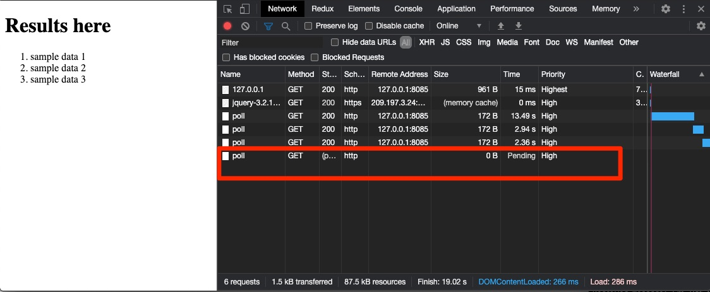

# ReactPHP LongPoll Example

In this example project, i would like to show you how to create a long poll application with ReactPHP.

# Installation

    git clone git@github.com:mahmutbayri/reactphp-long-poll.git
    cd reactphp-long-poll
    composer install

# Running
    
    php server.php
    
Now, you can visit the example from http://127.0.0.1:8085.

In order to push data you should use `redis-cli` or your favorite programming language.

Sample push on redis-cli

    PUBLISH test "sample data"
    PUBLISH test "sample data 2"
    ... 

# Notes

If you run your redis on a different port or host, please change `$redisClientUri` variable in `server.php`. My redis server runs on `127.0.0.1:6000`.

# Sample Page

